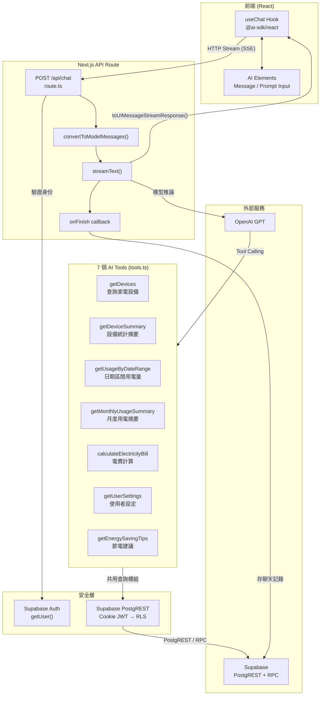
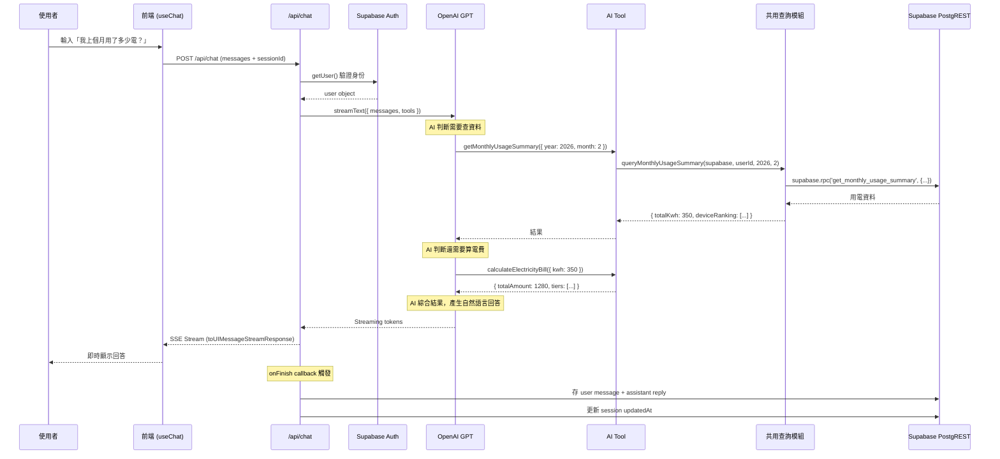
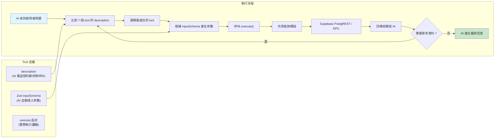

# AI SDK 架構與開發流程

## 整體架構



## Request 生命週期



## Tool Calling 資料流



## 關鍵程式碼

### route.ts — Streaming + 認證 + 持久化

```typescript
// src/app/api/chat/route.ts
import { createClient } from "@/lib/supabase/server";
import { openai } from "@ai-sdk/openai";
import { convertToModelMessages, stepCountIs, streamText, type UIMessage } from "ai";
import { createTools } from "./tools";

export async function POST(req: Request) {
  const supabase = await createClient();
  const { data: { user } } = await supabase.auth.getUser();
  if (!user) return new Response("Unauthorized", { status: 401 });

  const { messages, sessionId }: { messages: UIMessage[]; sessionId?: string } =
    await req.json();

  const result = streamText({
    model: openai(process.env.OPENAI_MODEL ?? DEFAULT_OPENAI_MODEL),
    system: getSystemPrompt(),
    messages: await convertToModelMessages(messages),
    tools: createTools(supabase, user.id),  // 傳入 Supabase client
    stopWhen: stepCountIs(5),
    async onFinish({ text }) {
      if (!sessionId) return;
      // 用 Supabase PostgREST 存聊天記錄
      await supabase.from("chat_messages").insert({
        session_id: sessionId, role: "user", content: userText,
      });
      if (text) {
        await supabase.from("chat_messages").insert({
          session_id: sessionId, role: "assistant", content: text,
        });
      }
      await supabase.from("chat_sessions")
        .update({ updated_at: new Date().toISOString() })
        .eq("id", sessionId);
    },
  });

  return result.toUIMessageStreamResponse();
}
```

### tools.ts — 7 個 AI Tools + 共用查詢模組

```typescript
// src/app/api/chat/tools.ts
import { tool } from "ai";
import { z } from "zod/v4";
import type { SupabaseClient } from "@supabase/supabase-js";
import type { Database } from "@/lib/supabase/database.types";
import { queryDevicesForTool, queryDeviceSummary, queryEnergySavingTips } from "@/queries/devices";
import { queryUsageByDateRange, queryMonthlyUsageSummary } from "@/queries/usage-logs";
import { queryGetUserSettings } from "@/queries/user-settings";
import { calculateBill } from "@/components/billing/calculate-bill";

export function createTools(supabase: SupabaseClient<Database>, userId: string) {
  return {
    getDevices: tool({
      description: "查詢使用者的所有家電設備",
      inputSchema: z.object({}),
      execute: () => queryDevicesForTool(supabase, userId),
    }),

    getDeviceSummary: tool({
      description: "取得設備統計摘要",
      inputSchema: z.object({}),
      execute: () => queryDeviceSummary(supabase, userId),
    }),

    getUsageByDateRange: tool({
      description: "查詢指定日期區間的每日用電量",
      inputSchema: z.object({
        startDate: z.string(),
        endDate: z.string(),
      }),
      execute: ({ startDate, endDate }) =>
        queryUsageByDateRange(supabase, userId, startDate, endDate),
    }),

    // ... getMonthlyUsageSummary, calculateElectricityBill,
    //     getUserSettings, getEnergySavingTips
  };
}
```

### 共用查詢模組 — MCP + Chat 共用

```typescript
// src/queries/devices.ts — 設備查詢
export async function queryDevicesForTool(supabase, userId) {
  const { data } = await supabase
    .from("devices")
    .select("*")
    .eq("user_id", userId)
    .order("created_at", { ascending: false });
  return data.map((d) => ({
    name: d.name,
    category: CATEGORY_LABELS[d.category] ?? d.category,
    ratedPowerW: d.rated_power_w,
    dailyHours: Number(d.daily_hours),
    isActive: d.is_active,
    monthlyKwh: Math.round((d.rated_power_w * Number(d.daily_hours) * 30) / 1000),
  }));
}

// src/queries/usage-logs.ts — RPC 呼叫
export async function queryMonthlyUsageSummary(supabase, userId, year, month) {
  const { data } = await supabase.rpc("get_monthly_usage_summary", {
    p_user_id: userId, p_year: year, p_month: month,
  });
  return data; // { totalKwh, dailyAvgKwh, co2Kg, deviceRanking }
}
```

## 檔案結構對照

```
AI 聊天系統架構

route.ts
├── 身份驗證 (Supabase Auth)
├── streamText() 核心呼叫
│   ├── model: OpenAI GPT
│   ├── system: 繁中系統提示詞
│   ├── tools: createTools(supabase, userId)
│   └── stopWhen: stepCountIs(5) ← 防止無限 loop
├── onFinish() 聊天持久化（Supabase PostgREST）
│   ├── 存 user 訊息
│   ├── 存 assistant 回覆
│   └── 更新 session 時間戳
└── toUIMessageStreamResponse() ← 一行搞定 SSE

tools.ts
├── createTools(supabase, userId) ← 接收 Supabase client
├── getDevices ← queryDevicesForTool()
├── getDeviceSummary ← queryDeviceSummary()
├── getUsageByDateRange ← queryUsageByDateRange()
├── getMonthlyUsageSummary ← queryMonthlyUsageSummary()
├── calculateElectricityBill ← calculateBill()（純計算）
├── getUserSettings ← queryGetUserSettings()
└── getEnergySavingTips ← queryEnergySavingTips()

共用查詢模組（與 MCP Server 共用）：
├── src/queries/devices.ts
├── src/queries/usage-logs.ts
└── src/queries/user-settings.ts
```
