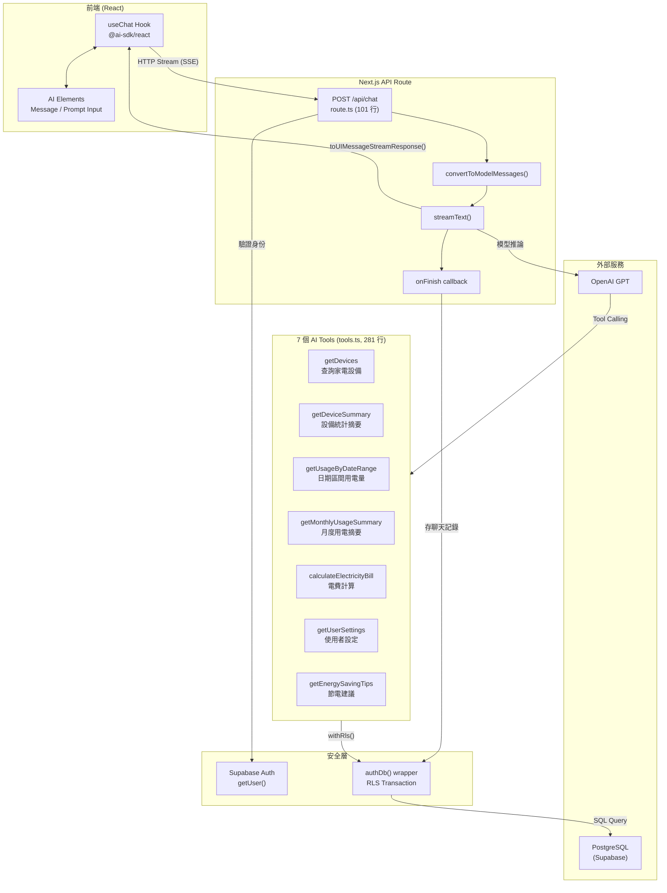
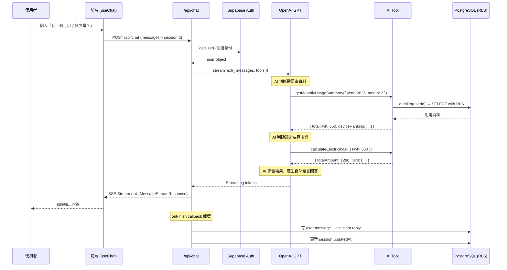
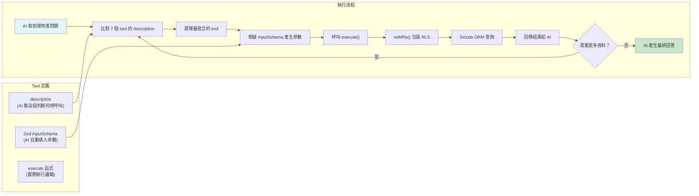

# AI SDK 架構與開發流程

## 整體架構



## Request 生命週期



## Tool Calling 資料流



## 關鍵程式碼

### route.ts — Streaming + 認證 + 持久化（101 行）

```typescript
// src/app/api/chat/route.ts
import { createClient } from "@/lib/supabase/server";
import { openai } from "@ai-sdk/openai";
import {
  convertToModelMessages,
  stepCountIs,
  streamText,
  type UIMessage,
} from "ai";
import { DEFAULT_OPENAI_MODEL } from "@/constants/ai";
import { createTools } from "./tools";

export const maxDuration = 30;

function getSystemPrompt() {
  const today = new Date().toISOString().slice(0, 10);
  return `你是 HomePower 智慧家庭用電助理。你可以幫使用者查詢家電設備、分析用電數據、計算電費、提供節電建議。

今天日期：${today}

回答規則：
- 使用繁體中文回答
- 回答要簡潔實用，善用數字和表格
- 如果需要查資料，先呼叫對應的工具再回答
- 提到金額時使用 TWD 或「元」為單位
- 提到用電量時使用 kWh 為單位
- 如果使用者問的問題跟家庭用電無關，禮貌地引導回用電相關話題
- 當比較月份用電時，主動說明夏月（6-9月）和非夏月的差異
- 使用者說「上個月」「這個月」等相對時間時，根據今天日期推算正確的年月
- 設備圖片會由前端自動顯示，回覆中不要輸出圖片 URL 或連結`;
}

export async function POST(req: Request) {
  const supabase = await createClient();
  const {
    data: { user },
  } = await supabase.auth.getUser();

  if (!user) {
    return new Response("Unauthorized", { status: 401 });
  }

  const { messages, sessionId }: { messages: UIMessage[]; sessionId?: string } =
    await req.json();

  const result = streamText({
    model: openai(process.env.OPENAI_MODEL ?? DEFAULT_OPENAI_MODEL),
    system: getSystemPrompt(),
    messages: await convertToModelMessages(messages),
    tools: createTools(user.id),
    stopWhen: stepCountIs(5),
    async onFinish({ text }) {
      if (!sessionId) return;

      try {
        const { authDb } = await import("@/db");
        const { chatMessages, chatSessions } = await import("@/db/schema");
        const { eq } = await import("drizzle-orm");

        await authDb(user.id, async (tx) => {
          // 存 user 最後一則訊息
          const lastUserMsg = messages.filter((m) => m.role === "user").pop();
          if (lastUserMsg) {
            const userText =
              lastUserMsg.parts
                ?.filter(
                  (p): p is { type: "text"; text: string } => p.type === "text",
                )
                .map((p) => p.text)
                .join("") ?? "";
            if (userText) {
              await tx.insert(chatMessages).values({
                sessionId,
                role: "user",
                content: userText,
              });
            }
          }

          // 存 assistant 回覆
          if (text) {
            await tx.insert(chatMessages).values({
              sessionId,
              role: "assistant",
              content: text,
            });
          }

          // 更新 session updatedAt
          await tx
            .update(chatSessions)
            .set({ updatedAt: new Date() })
            .where(eq(chatSessions.id, sessionId));
        });
      } catch (error) {
        console.error("Failed to save chat messages:", error);
      }
    },
  });

  return result.toUIMessageStreamResponse();
}
```

### tools.ts — 7 個 AI Tools + RLS 保護（281 行）

```typescript
// src/app/api/chat/tools.ts
import { tool } from "ai";
import { z } from "zod/v4";
import { eq, and, sql, desc, gte, lte } from "drizzle-orm";
import { db, authDb } from "@/db";
import { devices, usageLogs, userSettings } from "@/db/schema";
import { calculateBill } from "@/components/billing/calculate-bill";
import { isSummerMonth } from "@/constants/electricity-plans";
import { CATEGORY_LABELS, CO2_FACTOR_KG_PER_KWH } from "@/constants/device-presets";
import type { PlanType } from "@/lib/types";

export function createTools(userId: string) {
  /** 所有 tool 共用的 RLS wrapper */
  const withRls = <T>(fn: (tx: typeof db) => Promise<T>) =>
    authDb(userId, fn);

  return {
    getDevices: tool({
      description:
        "查詢使用者的所有家電設備，包含名稱、類別、額定功率、每日使用時數、是否啟用",
      inputSchema: z.object({}),
      execute: () =>
        withRls(async (tx) => {
          const rows = await tx
            .select()
            .from(devices)
            .where(eq(devices.userId, userId))
            .orderBy(desc(devices.createdAt));

          return rows.map((d) => ({
            name: d.name,
            category: CATEGORY_LABELS[d.category] ?? d.category,
            ratedPowerW: d.ratedPowerW,
            dailyHours: Number(d.dailyHours),
            isActive: d.isActive,
            imageUrl: d.imageUrl,
            monthlyKwh: Math.round(
              (d.ratedPowerW * Number(d.dailyHours) * 30) / 1000
            ),
          }));
        }),
    }),

    getDeviceSummary: tool({
      description:
        "取得設備統計摘要：總數、啟用數、預估月總用電量、各類別用電佔比",
      inputSchema: z.object({}),
      execute: () =>
        withRls(async (tx) => {
          const rows = await tx
            .select()
            .from(devices)
            .where(eq(devices.userId, userId));

          const total = rows.length;
          const active = rows.filter((d) => d.isActive).length;
          const activeDevices = rows.filter((d) => d.isActive);

          const totalMonthlyKwh = activeDevices.reduce(
            (sum, d) =>
              sum + (d.ratedPowerW * Number(d.dailyHours) * 30) / 1000,
            0
          );

          const byCategory: Record<string, number> = {};
          for (const d of activeDevices) {
            const label = CATEGORY_LABELS[d.category] ?? d.category;
            const kwh = (d.ratedPowerW * Number(d.dailyHours) * 30) / 1000;
            byCategory[label] = (byCategory[label] ?? 0) + kwh;
          }

          return {
            totalDevices: total,
            activeDevices: active,
            totalMonthlyKwh: Math.round(totalMonthlyKwh),
            co2Kg: Math.round(totalMonthlyKwh * CO2_FACTOR_KG_PER_KWH),
            categoryBreakdown: Object.entries(byCategory)
              .map(([cat, kwh]) => ({
                category: cat,
                kwh: Math.round(kwh),
                percent: Math.round((kwh / totalMonthlyKwh) * 100),
              }))
              .sort((a, b) => b.kwh - a.kwh),
          };
        }),
    }),

    getUsageByDateRange: tool({
      description:
        "查詢指定日期區間的每日用電量（kWh），可用於趨勢分析、月度比較",
      inputSchema: z.object({
        startDate: z.string().describe("起始日期 YYYY-MM-DD"),
        endDate: z.string().describe("結束日期 YYYY-MM-DD"),
      }),
      execute: ({ startDate, endDate }) =>
        withRls(async (tx) => {
          const rows = await tx
            .select({
              date: usageLogs.date,
              totalKwh: sql<string>`sum(${usageLogs.kwh})::numeric(10,2)`,
            })
            .from(usageLogs)
            .where(
              and(
                eq(usageLogs.userId, userId),
                gte(usageLogs.date, new Date(startDate)),
                lte(usageLogs.date, new Date(endDate))
              )
            )
            .groupBy(usageLogs.date)
            .orderBy(usageLogs.date);

          return rows.map((r) => ({
            date:
              r.date instanceof Date
                ? r.date.toISOString().slice(0, 10)
                : String(r.date),
            kwh: Number(r.totalKwh),
          }));
        }),
    }),

    getMonthlyUsageSummary: tool({
      description:
        "查詢指定年月的月度用電摘要：總 kWh、日均 kWh、各設備用電排名",
      inputSchema: z.object({
        year: z.number().describe("年份，例如 2026"),
        month: z.number().min(1).max(12).describe("月份 1-12"),
      }),
      execute: ({ year, month }) =>
        withRls(async (tx) => {
          const startDate = `${year}-${String(month).padStart(2, "0")}-01`;
          const endDate =
            month === 12
              ? `${year + 1}-01-01`
              : `${year}-${String(month + 1).padStart(2, "0")}-01`;

          const rows = await tx
            .select({
              deviceId: usageLogs.deviceId,
              totalKwh: sql<string>`sum(${usageLogs.kwh})::numeric(10,2)`,
            })
            .from(usageLogs)
            .where(
              and(
                eq(usageLogs.userId, userId),
                gte(usageLogs.date, new Date(startDate)),
                lte(usageLogs.date, new Date(endDate))
              )
            )
            .groupBy(usageLogs.deviceId);

          const deviceRows = await tx
            .select({ id: devices.id, name: devices.name })
            .from(devices)
            .where(eq(devices.userId, userId));

          const deviceMap = new Map(deviceRows.map((d) => [d.id, d.name]));

          const deviceUsage = rows
            .map((r) => ({
              device: deviceMap.get(r.deviceId ?? "") ?? "未知設備",
              kwh: Number(r.totalKwh),
            }))
            .sort((a, b) => b.kwh - a.kwh);

          const totalKwh = deviceUsage.reduce((s, d) => s + d.kwh, 0);
          const daysInMonth = new Date(year, month, 0).getDate();

          return {
            year,
            month,
            totalKwh: Math.round(totalKwh),
            dailyAvgKwh: Math.round(totalKwh / daysInMonth),
            co2Kg: Math.round(totalKwh * CO2_FACTOR_KG_PER_KWH),
            deviceRanking: deviceUsage,
          };
        }),
    }),

    calculateElectricityBill: tool({
      description:
        "根據用電量計算電費。支援住宅累進制、時間電價二段式、三段式",
      inputSchema: z.object({
        kwh: z.number().describe("總用電量 kWh"),
        planType: z
          .enum(["residential", "time_of_use_2", "time_of_use_3"])
          .default("residential")
          .describe("電價方案"),
        month: z
          .number()
          .min(1)
          .max(12)
          .optional()
          .describe("月份（判斷夏月），不填預設當月"),
      }),
      execute: async ({ kwh, planType, month }) => {
        const isSummer = isSummerMonth(month);
        const result = calculateBill({
          kwh,
          planType: planType as PlanType,
          isSummer,
          peakKwh: Math.round(kwh * 0.6),
          offPeakKwh: Math.round(kwh * 0.4),
          midPeakKwh: Math.round(kwh * 0.25),
        });
        return {
          ...result,
          isSummer,
          note: isSummer ? "夏月費率（6-9月）" : "非夏月費率",
        };
      },
    }),

    getUserSettings: tool({
      description: "查詢使用者設定：電價方案、所在地區、家庭人數",
      inputSchema: z.object({}),
      execute: () =>
        withRls(async (tx) => {
          const [settings] = await tx
            .select()
            .from(userSettings)
            .where(eq(userSettings.userId, userId));

          return (
            settings ?? {
              planType: "residential",
              location: "高雄",
              householdSize: 3,
            }
          );
        }),
    }),

    getEnergySavingTips: tool({
      description:
        "根據使用者的設備和用電資料，提供節電建議。會自動分析高耗電設備",
      inputSchema: z.object({}),
      execute: () =>
        withRls(async (tx) => {
          const rows = await tx
            .select()
            .from(devices)
            .where(
              and(eq(devices.userId, userId), eq(devices.isActive, true))
            );

          const tips: string[] = [];
          const highPower = rows
            .filter((d) => d.ratedPowerW >= 1000)
            .sort((a, b) => b.ratedPowerW - a.ratedPowerW);

          for (const d of highPower) {
            const monthlyKwh =
              (d.ratedPowerW * Number(d.dailyHours) * 30) / 1000;
            if (d.category === "aircon" && Number(d.dailyHours) > 6) {
              tips.push(
                `${d.name}每日使用 ${d.dailyHours} 小時，月耗 ${Math.round(monthlyKwh)} kWh。建議搭配電扇，溫度設定 26-28°C，可節省 15-20% 用電`
              );
            } else if (
              d.category === "water_heater" &&
              d.ratedPowerW >= 3000
            ) {
              tips.push(
                `${d.name}（${d.ratedPowerW}W）耗電較高，月耗 ${Math.round(monthlyKwh)} kWh。建議考慮更換熱泵熱水器，可省 60-70% 電費`
              );
            } else {
              tips.push(
                `${d.name}（${d.ratedPowerW}W）月耗 ${Math.round(monthlyKwh)} kWh，建議減少使用時數或選用節能機型`
              );
            }
          }

          if (tips.length === 0) {
            tips.push("您的設備用電都在合理範圍內，繼續保持！");
          }

          return { tips };
        }),
    }),
  };
}
```

### authDb() — RLS 安全層（38 行）

```typescript
// src/db/index.ts
import { drizzle } from "drizzle-orm/node-postgres";
import { sql } from "drizzle-orm";
import * as schema from "./schema";

export const db =
  globalForDb.db ??
  drizzle({
    connection: { connectionString: process.env.DATABASE_URL! },
    schema,
  });

export async function authDb<T>(
  userId: string,
  fn: (tx: typeof db) => Promise<T>
): Promise<T> {
  return db.transaction(async (tx) => {
    await tx.execute(
      sql`SELECT set_config('role', 'authenticated', true)`
    );
    await tx.execute(
      sql`SELECT set_config('request.jwt.claims', ${JSON.stringify({ sub: userId })}, true)`
    );
    return fn(tx as unknown as typeof db);
  });
}
```

## 檔案結構對照

```
382 行 = 完整 AI 聊天系統

route.ts (101 行)
├── 身份驗證 (Supabase Auth)
├── streamText() 核心呼叫
│   ├── model: OpenAI GPT
│   ├── system: 繁中系統提示詞
│   ├── tools: createTools(userId)
│   └── stopWhen: stepCountIs(5) ← 防止無限 loop
├── onFinish() 聊天持久化
│   ├── 存 user 訊息
│   ├── 存 assistant 回覆
│   └── 更新 session 時間戳
└── toUIMessageStreamResponse() ← 一行搞定 SSE

tools.ts (281 行)
├── withRls wrapper ← 所有 tool 共用的 RLS 保護
├── getDevices ← 設備清單
├── getDeviceSummary ← 統計摘要 + 類別佔比
├── getUsageByDateRange ← 時間區間用電趨勢
├── getMonthlyUsageSummary ← 月度報表 + 設備排名
├── calculateElectricityBill ← 3 種電價方案計算
├── getUserSettings ← 使用者偏好設定
└── getEnergySavingTips ← 智能節電建議
```
