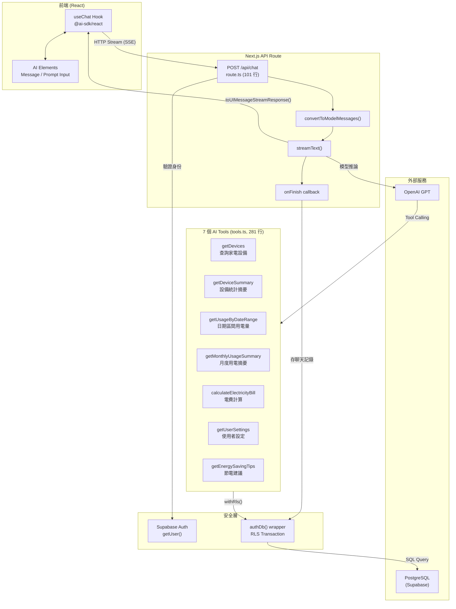
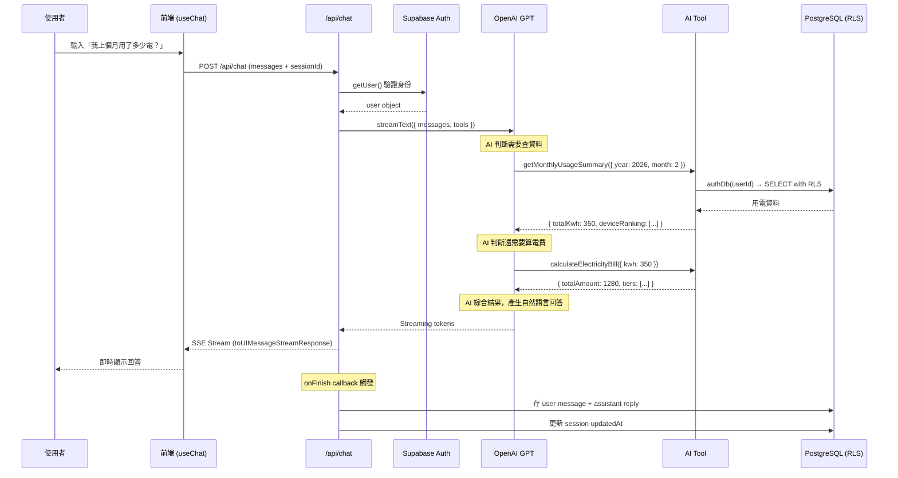
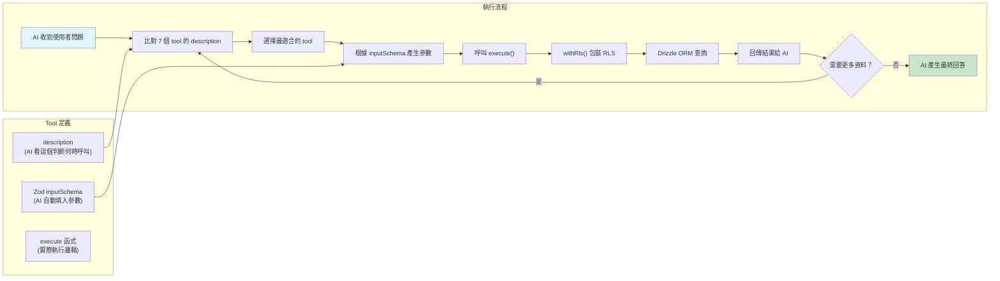

# AI SDK 架構與開發流程

## 整體架構



## Request 生命週期



## Tool Calling 資料流



## 關鍵程式碼對照

```
382 行 = 完整 AI 聊天系統

route.ts (101 行)
├── 身份驗證 (Supabase Auth)
├── streamText() 核心呼叫
│   ├── model: OpenAI GPT
│   ├── system: 繁中系統提示詞
│   ├── tools: createTools(userId)
│   └── stopWhen: stepCountIs(5) ← 防止無限 loop
├── onFinish() 聊天持久化
│   ├── 存 user 訊息
│   ├── 存 assistant 回覆
│   └── 更新 session 時間戳
└── toUIMessageStreamResponse() ← 一行搞定 SSE

tools.ts (281 行)
├── withRls wrapper ← 所有 tool 共用的 RLS 保護
├── getDevices ← 設備清單
├── getDeviceSummary ← 統計摘要 + 類別佔比
├── getUsageByDateRange ← 時間區間用電趨勢
├── getMonthlyUsageSummary ← 月度報表 + 設備排名
├── calculateElectricityBill ← 3 種電價方案計算
├── getUserSettings ← 使用者偏好設定
└── getEnergySavingTips ← 智能節電建議
```
