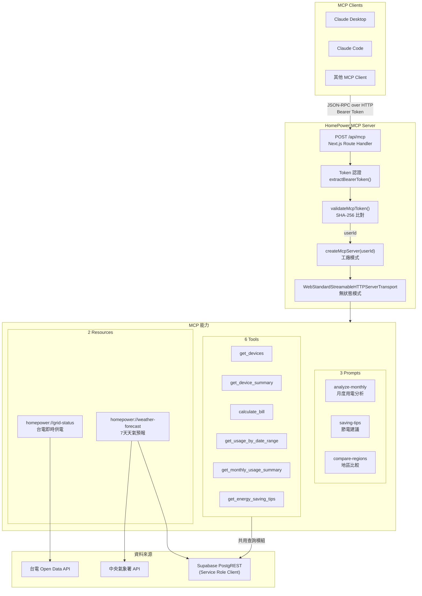
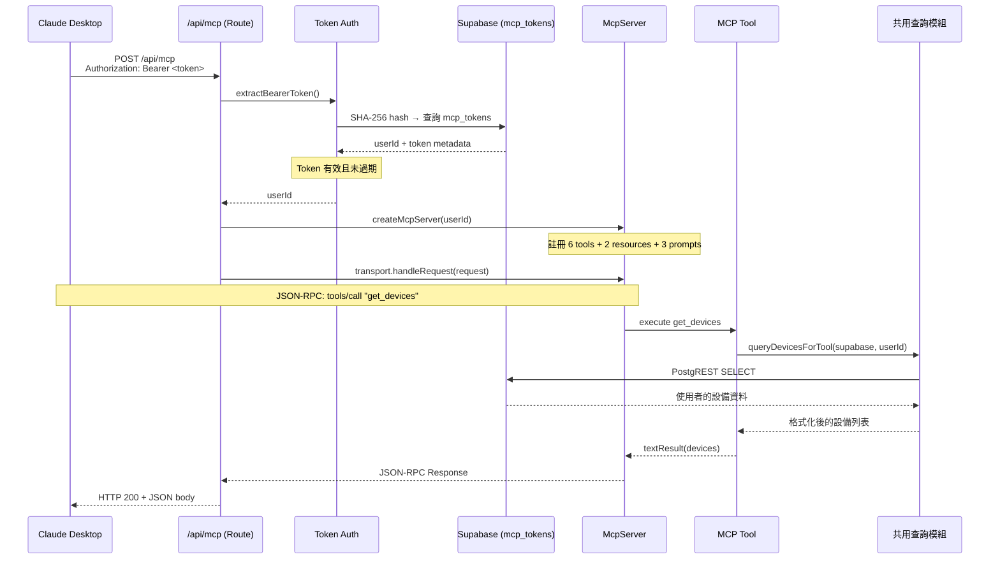
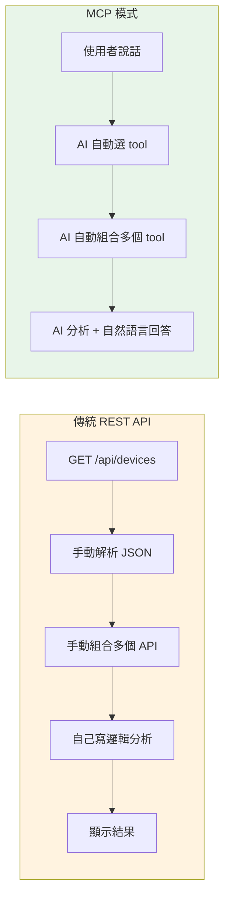
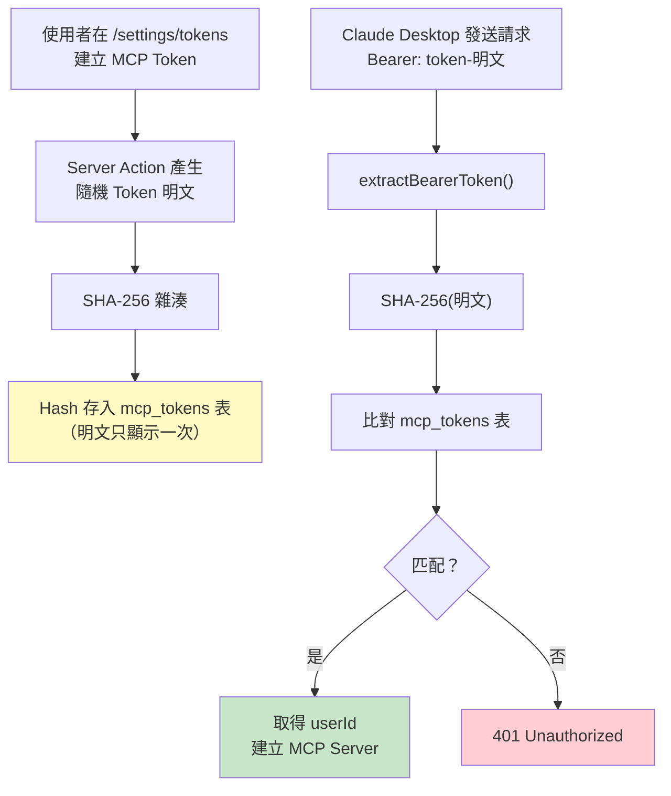
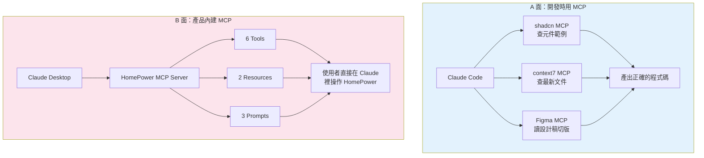

# MCP Server 架構與開發流程

## 整體架構



## Request 生命週期



## MCP vs REST API 對比



## Token 認證流程



## 開發時 MCP vs 產品內 MCP



## 關鍵程式碼

### Token 認證 — mcp-auth.ts

```typescript
// src/lib/mcp-auth.ts
import { createHash } from "crypto";
import { createServiceClient } from "@/lib/supabase/service";
import { queryValidateMcpToken } from "@/queries/tokens";

function hashToken(raw: string): string {
  return createHash("sha256").update(raw).digest("hex");
}

export async function validateMcpToken(
  rawToken: string
): Promise<string | null> {
  const hash = hashToken(rawToken);
  const supabase = createServiceClient();
  return queryValidateMcpToken(supabase, hash);
}
```

### MCP Server 工廠 + 認證入口

```typescript
// src/app/api/mcp/route.ts — Helpers & Factory

function extractBearerToken(request: Request): string | null {
  const auth = request.headers.get("authorization");
  if (!auth?.startsWith("Bearer ")) return null;
  return auth.slice(7);
}

async function authenticateRequest(
  request: Request
): Promise<Response | string> {
  const token = extractBearerToken(request);
  if (!token) return jsonResponse({ error: "未提供 API 權杖" }, 401);

  const userId = await validateMcpToken(token);
  if (!userId)
    return jsonResponse({ error: "無效或已過期的 API 權杖" }, 401);

  return userId;
}

function createMcpServer(userId: string): McpServer {
  const server = new McpServer({
    name: "homepower",
    version: "1.0.0",
  });

  const supabase = createServiceClient();
  registerTools(server, supabase, userId);
  registerResources(server, supabase, userId);
  registerPrompts(server);

  return server;
}
```

### registerTools() — 使用共用查詢模組

```typescript
// src/app/api/mcp/route.ts — registerTools
import { queryDevicesForTool, queryDeviceSummary, queryEnergySavingTips } from "@/queries/devices";
import { queryUsageByDateRange, queryMonthlyUsageSummary } from "@/queries/usage-logs";

function registerTools(server, supabase, userId) {
  // Tool 1: 查詢設備 — 呼叫共用查詢函數
  server.registerTool("get_devices", { description: "查詢使用者的所有家電設備" }, async () => {
    const data = await queryDevicesForTool(supabase, userId);
    return textResult(data);
  });

  // Tool 3: 電費計算（帶 Zod inputSchema）
  server.registerTool(
    "calculate_bill",
    {
      description: "根據用電量計算電費",
      inputSchema: z.object({
        kwh: z.number().describe("總用電量 kWh"),
        planType: z.enum(["residential", "time_of_use_2", "time_of_use_3"]).default("residential"),
        month: z.number().min(1).max(12).optional(),
      }),
    },
    async ({ kwh, planType, month }) => {
      const isSummer = isSummerMonth(month);
      const result = calculateBill({ kwh, planType, isSummer, ... });
      return textResult({ ...result, isSummer });
    }
  );

  // ... get_device_summary, get_usage_by_date_range,
  //     get_monthly_usage_summary, get_energy_saving_tips
}
```

### registerResources() — 2 個外部資料源

```typescript
// src/app/api/mcp/route.ts — registerResources

function registerResources(server, supabase, userId) {
  // Resource 1: 台電即時供電
  server.registerResource(
    "grid-status",
    "homepower://grid-status",
    { description: "台灣電力系統即時供電狀態", mimeType: "application/json" },
    async () => {
      const data = await fetchGridStatus();
      return resourceResult("homepower://grid-status", data);
    }
  );

  // Resource 2: 天氣預報（需要使用者地區設定）
  server.registerResource(
    "weather-forecast",
    "homepower://weather-forecast",
    { description: "7 天天氣預報與冷氣預估使用時數", mimeType: "application/json" },
    async () => {
      const settings = await queryGetUserSettings(supabase, userId);
      const location = settings?.location ? `${settings.location}市` : "高雄市";
      const data = await fetchWeatherForecast(location);
      return resourceResult("homepower://weather-forecast", data);
    }
  );
}
```

### Route Handler — 無狀態 HTTP 入口

```typescript
// src/app/api/mcp/route.ts — Route Handlers

async function handleMcpRequest(request: Request): Promise<Response> {
  const result = await authenticateRequest(request);
  if (result instanceof Response) return result;

  const server = createMcpServer(result);
  const transport = new WebStandardStreamableHTTPServerTransport({
    sessionIdGenerator: undefined, // stateless
  });
  await server.connect(transport);

  const body = await request.clone().text();
  const response = await transport.handleRequest(request, {
    parsedBody: body ? JSON.parse(body) : undefined,
  });
  return response;
}

export async function POST(request: Request) {
  return handleMcpRequest(request);
}

export async function GET() {
  return new Response(null, { status: 405 }); // 無狀態不支援 SSE
}
```

## 檔案結構對照

```
MCP Server 架構

src/app/api/mcp/route.ts
├── Helpers (50 行)
│   ├── extractBearerToken() ← 從 Header 取 Token
│   ├── jsonResponse() ← 統一錯誤回應格式
│   ├── textResult() ← Tool 回傳格式
│   ├── resourceResult() ← Resource 回傳格式
│   └── authenticateRequest() ← Token 驗證入口
│
├── MCP Server Factory
│   └── createMcpServer(userId) ← 組裝 tools + resources + prompts
│
├── registerTools()
│   ├── get_devices ← queryDevicesForTool()
│   ├── get_device_summary ← queryDeviceSummary()
│   ├── calculate_bill ← calculateBill()（純計算）
│   ├── get_usage_by_date_range ← queryUsageByDateRange()
│   ├── get_monthly_usage_summary ← queryMonthlyUsageSummary()
│   └── get_energy_saving_tips ← queryEnergySavingTips()
│
├── registerResources()
│   ├── homepower://grid-status ← fetchGridStatus()
│   └── homepower://weather-forecast ← queryGetUserSettings() + fetchWeatherForecast()
│
├── registerPrompts()
│   ├── analyze-monthly ← 月度分析模板
│   ├── saving-tips ← 節電建議模板
│   └── compare-regions ← 地區比較模板
│
└── Route Handlers
    ├── POST → handleMcpRequest() ← 主要入口
    ├── GET → 405 ← 無狀態模式不支援 SSE
    └── DELETE → 405

共用查詢模組（MCP + Chat 共用）：
├── src/queries/devices.ts ← 設備查詢 + 摘要 + 節電建議
├── src/queries/usage-logs.ts ← 用電 RPC 函數
├── src/queries/tokens.ts ← Token 驗證
└── src/queries/user-settings.ts ← 使用者設定

相關檔案：
├── src/lib/mcp-auth.ts ← SHA-256 Token 驗證
├── src/lib/supabase/service.ts ← Service role client
├── src/actions/tokens.ts ← Token CRUD Server Actions
├── src/lib/grid-status.ts ← 台電 API 抓取 + 解析
└── src/lib/weather.ts ← 氣象署 API 抓取 + 解析
```
