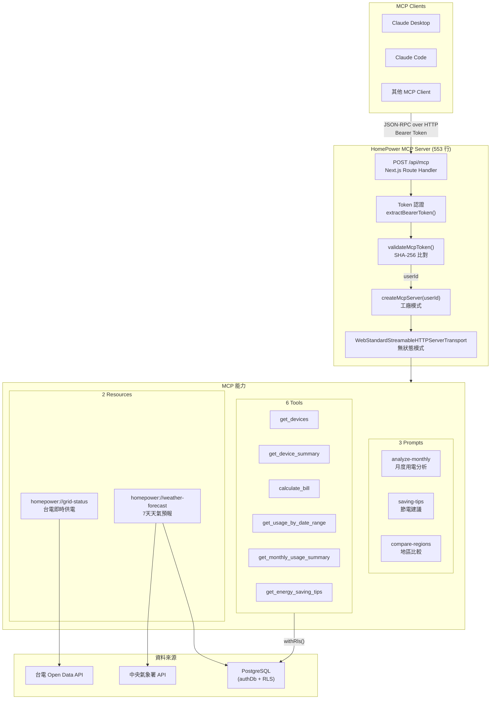
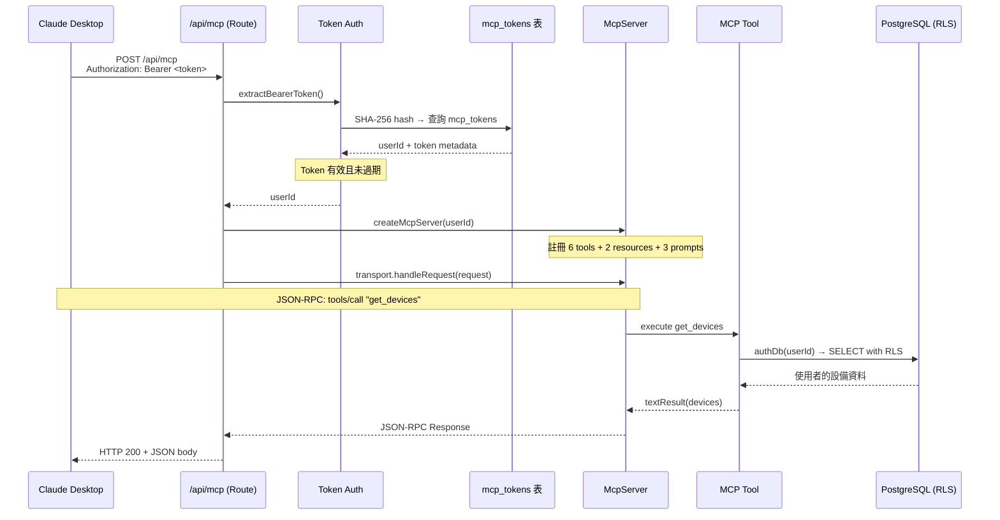
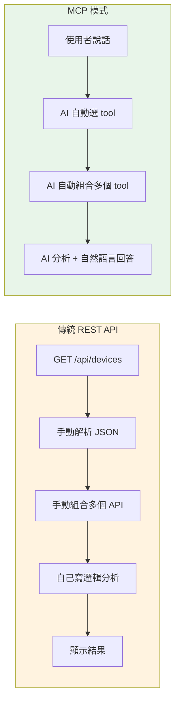
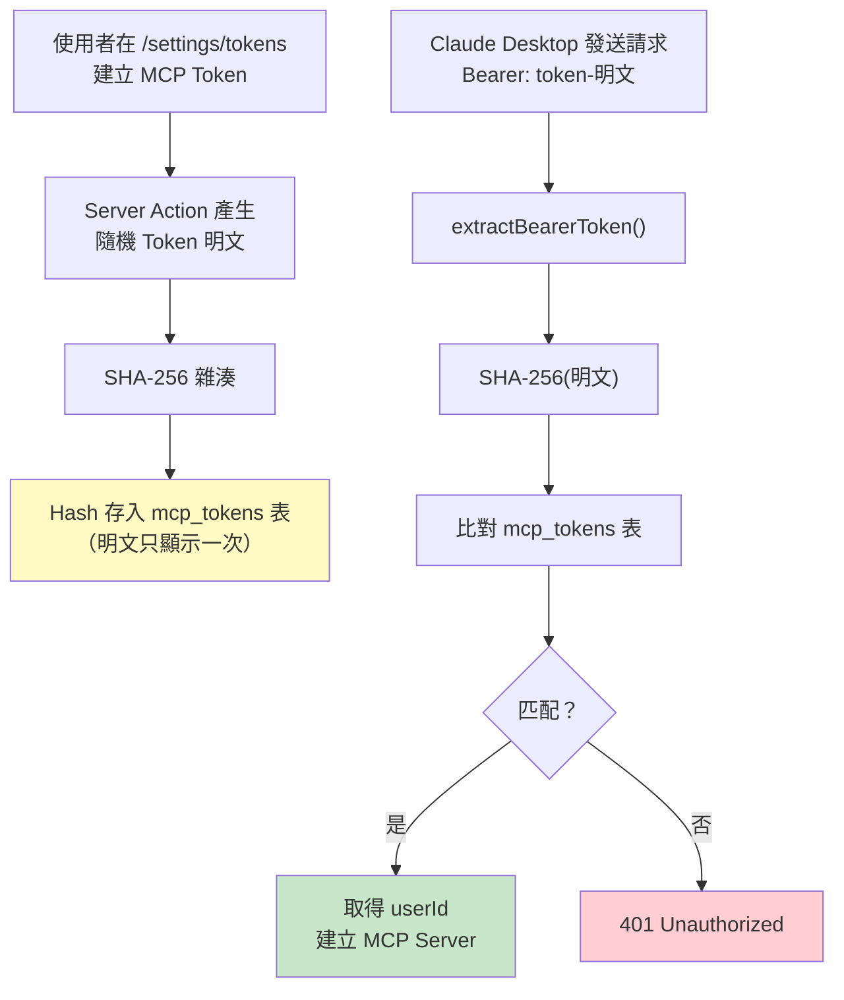
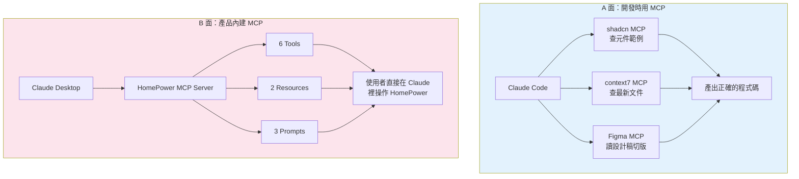

# MCP Server 架構與開發流程

## 整體架構



## Request 生命週期



## MCP vs REST API 對比



## Token 認證流程



## 開發時 MCP vs 產品內 MCP



## 檔案結構對照

```
MCP Server 完整實作 = 553 行（單一檔案）

src/app/api/mcp/route.ts
├── Helpers (50 行)
│   ├── extractBearerToken() ← 從 Header 取 Token
│   ├── jsonResponse() ← 統一錯誤回應格式
│   ├── textResult() ← Tool 回傳格式
│   ├── resourceResult() ← Resource 回傳格式
│   └── authenticateRequest() ← Token 驗證入口
│
├── MCP Server Factory (12 行)
│   └── createMcpServer(userId) ← 組裝 tools + resources + prompts
│
├── registerTools() (265 行)
│   ├── get_devices ← 設備清單
│   ├── get_device_summary ← 統計摘要
│   ├── calculate_bill ← 電費計算（Zod schema 驗證輸入）
│   ├── get_usage_by_date_range ← 用電趨勢
│   ├── get_monthly_usage_summary ← 月報表
│   └── get_energy_saving_tips ← 節電建議
│
├── registerResources() (53 行)
│   ├── homepower://grid-status ← 台電即時供電 API
│   └── homepower://weather-forecast ← 氣象署 + 使用者所在地
│
├── registerPrompts() (90 行)
│   ├── analyze-monthly ← 月度分析模板
│   ├── saving-tips ← 節電建議模板
│   └── compare-regions ← 地區比較模板
│
└── Route Handlers (40 行)
    ├── POST → handleMcpRequest() ← 主要入口
    ├── GET → 405 ← 無狀態模式不支援 SSE
    └── DELETE → 405

相關檔案：
├── src/lib/mcp-auth.ts ← SHA-256 Token 驗證
├── src/app/actions/tokens.ts ← Token CRUD Server Actions
├── src/lib/grid-status.ts ← 台電 API 抓取 + 解析
└── src/lib/weather.ts ← 氣象署 API 抓取 + 解析
```
